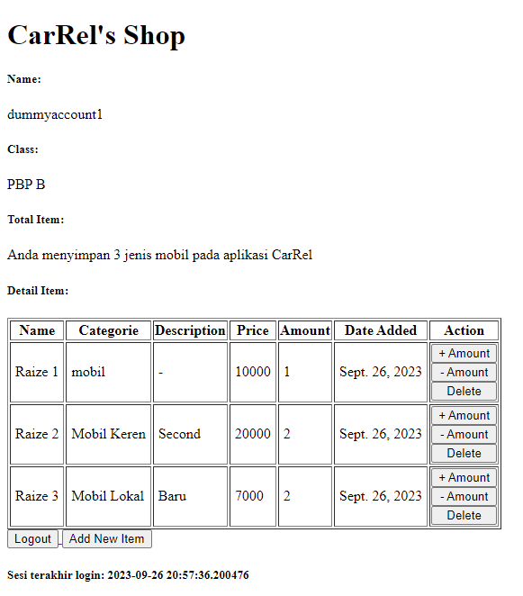
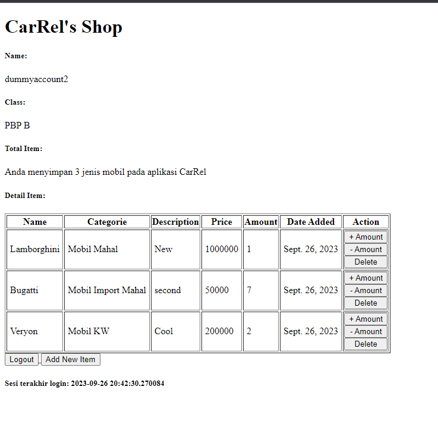
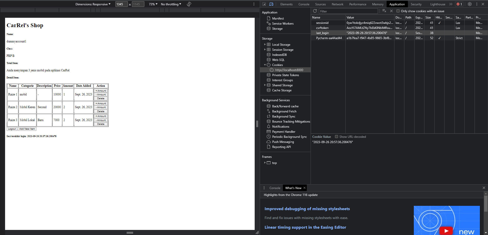

# Tugas 2,3,4 PBP (Tugas 4 diatas, Tugas lainnya dibawah)

# CarRel App
# [Link App](https://carrel.adaptable.app/main/)
# **Muhammad Farrel Altaf (2206829332) - PBP B**

# Tugas 4
## **No 1**
1. Apa itu Django `UserCreationForm`, dan jelaskan apa kelebihan dan kekurangannya?
* UserCreationForm adalah sebuah kelas formulir yang disediakan oleh Django, sebuah framework _web development_ berbasis Python, untuk menangani proses pembuatan akun pengguna baru.
  Formulir ini merupakan bagian dari modul django.contrib.auth.forms dan secara default mencakup validasi untuk kolom username, password1, dan password2. 
* Kelebihan :
  - Mudah diintegrasikan karena merupakan bagian dari framework Django.
  - Memiliki fitur validasi otomatis seperti seperti memastikan kata sandi memenuhi kriteria tertentu dan `username` unik.
  - Dapat dikustomisasi sesuai kebutuhan.
  - Memiliki keamanan yang baik.
* Kekurangan :
  - Fitur yang terbatas jika ingin autentikasi dua faktor dan konfirmasi melalui email.
  - Memiliki batasan validasi data yang spesifik.
  - Tampilan yang _default_ dan kurang menarik.

## **No 2**
2. Apa perbedaan antara autentikasi dan otorisasi dalam konteks Django, dan mengapa keduanya penting?
* Autentikasi
  - Dalam konteks Django, autentikasi adalah proses verifikasi identitas pengguna. Django menyediakan mekanisme autentikasi yang melibatkan penggunaan `username` dan `password`
* Otorisasi
  - Setelah autentikasi, langkah selanjutnya adalah otorisasi, yaitu menentukan apa yang bisa diakses atau dilakukan oleh pengguna yang sudah terautentikasi.
* Mengapa keduanya penting?
  - Penting untuk keamanan.  Tanpa autentikasi dan otorisasi, aplikasi menjadi rentan terhadap serangan dan penyalahgunaan data.
  - Penting untuk kontrol akses. Otorisasi membantu dalam mengatur apa yang boleh dan tidak boleh diakses oleh pengguna.

## **No 3**
3. Apa itu cookies dalam konteks aplikasi web, dan bagaimana Django menggunakan cookies untuk mengelola data sesi pengguna?
* Cookies dalam aplikasi web
  - Cookies adalah file kecil data yang disimpan oleh peramban web di sisi klien. Tujuannya adalah untuk menyimpan informasi tentang sesi pengguna atau preferensi lainnya untuk mempermudah interaksi antara pengguna dan situs web. 
  - Dalam konteks aplikasi web, cookies digunakan untuk mengelola data sesi pengguna, yaitu informasi yang disimpan oleh server tentang pengguna selama mereka menggunakan aplikasi web.
* Bagaimana Django menggunakan cookies
  - Django menggunakan cookies terutama untuk mengelola data sesi pengguna. Ketika pengguna pertama kali mengakses aplikasi web Django, sebuah cookie unik, biasanya dengan nama `sessionid`, dibuat dan disimpan di peramban pengguna. Setiap kali pengguna kembali mengakses aplikasi, cookie ini dikirimkan kembali ke server, yang memungkinkan Django untuk mengidentifikasi dan mengembalikan data sesi yang berhubungan.

## **No 4**
4. Apakah penggunaan cookies aman secara default dalam pengembangan web, atau apakah ada risiko potensial yang harus diwaspadai?
* Penggunaan cookies dalam pengembangan web tidak bisa dianggap aman secara _default_ dan memerlukan pertimbangan keamanan yang serius. Cookies digunakan untuk menyimpan informasi tentang sesi pengguna, preferensi, atau bahkan kredensial login, dan secara _default_ mereka rentan terhadap sejumlah potensi risiko keamanan.
* Beberapa risiko potensial yang kemungkinan terjadi :
  - Cross-Site Scripting (XSS)
  - Cross-Site Request Forgery (CSRF)
  - Third-Party Cookies
* Tindakan keamanan yang dapat dilakukan untuk mencegah risiko potensial :
  - Mengenkripsi data cookies
  - Menetapkan waktu kadaluarsa dengan tepat
  - Memastikan cookies digunakan pada koneksi yang aman
* Dengan demikian, penting sekali untuk memastikan implementasi cookies yang tepat dan merancang protokol keamanan yang akan melindungi data pengguna yang sensitif. 


## **No 5**
5. Jelaskan bagaimana cara kamu mengimplementasikan checklist di atas secara step-by-step
   * A. Mengimplementasikan fungsi registrasi, login, dan logout untuk memungkinkan pengguna untuk mengakses aplikasi sebelumnya dengan lancar.
     - Fungsi Registrasi
       - Saya melakukan import kode berikut di `views.py` pada driketori aplikasi `main`
         ```py
         from django.shortcuts import redirect
         from django.contrib.auth.forms import UserCreationForm
         from django.contrib import messages  
         ```
       - Setelah itu, saya membuat fungsi `register` yang berfungsi untuk meminta parameter request dan diisi dengan kode berikut
         ```py
         def register(request):
         form = UserCreationForm()
    
         if request.method == "POST":
             form = UserCreationForm(request.POST)
             if form.is_valid():
                 form.save()
                 messages.success(request, 'Your account has been successfully created!')
                 return redirect('main:login')
         context = {'form':form}
         return render(request, 'register.html', context)
         ```
       - Lalu saya membuat file `register.html` pada direktori `templates` pada direktori aplikasi main dengan kode sebagai berikut
         ```py
            

            
                <title>Register</title>
            
            
              
            
            <div class = "login">
                
                <h1>Register</h1>  
            
                    <form method="POST" >  
                          
                        <table>  
                            {{ form.as_table }}  
                            <tr>  
                                <td></td>
                                <td><input type="submit" name="submit" value="Daftar"/></td>  
                            </tr>  
                        </table>  
                    </form>
            
                  
                    <ul>   
                          
                            <li>{{ message }}</li>  
                              
                    </ul>   
                
            
            </div>  
            
            
         ```
        - Setelah itu, saya melakukan import fungsi register yang sudah saya buat pada subdirektori `main` 
          ```py
          from main.views import register 
          ``` 
        - Setelah itu, saya menambahkan _path url_ ke dalam `urlpatterns` agar mengakses fungsi register yang sudah syaa buat
          ```py
          path('register/', register, name='register'),
          ```
     
     - Fungsi Login
       - Saya melakukan import kode berikut di `views.py` pada direktori aplikasi main
         ```py
         from django.contrib.auth import authenticate, login        
         ```
       - Kemudian saya membuat fungsi `login_user` di `views.py` pada direktori aplikasi main dengan kode berikut:
         ```py
         def login_user(request):
         if request.method == 'POST':
            username = request.POST.get('username')
            password = request.POST.get('password')
            user = authenticate(request, username=username, password=password)
            if user is not None:
                login(request, user)
                response = HttpResponseRedirect(reverse("main:show_main")) 
                response.set_cookie('last_login', str(datetime.datetime.now()))
                return response
            else:
                messages.info(request, 'Sorry, incorrect username or password. Please try again.')
         context = {}
         return render(request, 'login.html', context)
         ```
         Saya memanfaatkan cookie dengan menambahkan `response.set_cookie('last_login', str(datetime.datetime.now()))` dengan key last_login dan value tanggal login pada saat itu
       
        - Setelah itu, saya membuat `login.html` pada direktori `templates` dengan kode berikut:
         ```py
         

         
             <title>Login</title>
         
            
         
            
         <div class = "login">
            
             <h1>Login</h1>
            
             <form method="POST" action="">
                 
                 <table>
                     <tr>
                         <td>Username: </td>
                         <td><input type="text" name="username" placeholder="Username" class="form-control"></td>
                     </tr>
                                
                     <tr>
                         <td>Password: </td>
                         <td><input type="password" name="password" placeholder="Password" class="form-control"></td>
                     </tr>
            
                     <tr>
                         <td></td>
                         <td><input class="btn login_btn" type="submit" value="Login"></td>
                     </tr>
                 </table>
             </form>
            
             
                 <ul>
                     
                         <li>{{ message }}</li>
                     
                 </ul>
                  
                    
             Don't have an account yet? <a href="">Register Now</a>
            
         </div>
            
         
            
         ```

        - Setelah itu, saya melakukan import pada urls.py pada subdirektori `main` dengan kode berikut:
         ```py
         from main.views import login_user
         ```
        - Setelah itu, saya menambahkan path url untuk login pada `urlpatterns` dengan kode sebagai berikut:
         ```py
         path('login/', login_user, name='login'),
         ```
     - Fungsi Logout
       - Saya melakukan import kode berikut di `views.py` direktori aplikasi
         ```py
         from django.contrib.auth import logout
         ```
       - Setelah itu, saya membuat fungsi `logout_user` di `views.py` direktori aplikasi dengan kode berikut:
         ```py
         def logout_user(request):
           logout(request)
           response = HttpResponseRedirect(reverse('main:login'))
           response.delete_cookie('last_login')
           return response
         ```
         Disini dilakukan penghapusan cookie dengan key `last_login` saat user logout

       - Setelah itu, saya menambahkan button logout di `main.html` dengan kode berikut
         ```py
         
            <a href="">
                <button>
                    Logout
                </button>
            </a>
            
         ```
       - Setelah itu, saya melakukan import fungsi `logout_user` di `urls.py` di subdirektori main
         ```py
         from main.views import logout_user
         ```
       - Setalah itu, saya melakukan routing ke dalam `urlpatterns` di `urls.py` di subdirektori main
         ```py
            path('logout/', logout_user, name='logout'),
         ```
     - Restriksi akses aplikasi
       - import `login_required` di `views.py`
       - Tambahkan `@login_required(login_url='/login')` di atas fungsi `show_main`
   


   * B. Membuat dua akun pengguna dengan masing-masing tiga dummy data menggunakan model yang telah dibuat pada aplikasi sebelumnya untuk setiap akun di lokal.
    
   
   

   * C.Menghubungkan model Item dengan User 
     - Melakukan import pada `models.py`
     ```py
     from django.contrib.auth.models import User
     ```
     - Tambahkan potongan kode berikut pada model `Item`
     ```py
     class Item(models.Model):
        user = models.ForeignKey(User, on_delete=models.CASCADE)
     ```
     - Tambahkan potongan kode pada `create_item` di `views.py` agar item yang dibuat terasosiasi pada user
     ```py
     def create_item(request):
         form = ItemForm(request.POST or None)
        
         if form.is_valid() and request.method == "POST":
             item = form.save(commit=False)
             item.user = request.user
             item.save()
             return HttpResponseRedirect(reverse('main:show_main'))
     ```
     - Setelah itu, ubah fungsi `show_main` menjadi
     - ```py
       def show_main(request):
            items = Item.objects.filter(user=request.user)
       ...
        context = {
            'name': request.user.username,
       ...
       ```
     - Setelah itu, jangan lupa lakukan migrasi
   
    
   * D. Menampilkan detail informasi pengguna yang sedang logged in seperti username dan menerapkan cookies seperti last login pada halaman utama aplikasi.  
     - Menampilkan username pengguna
       Pada fungsi `show_main` di `views.py` ubah isi context dengan key `name` menjadi berikut
       ```py
       'name': request.user.username,
       ```
     - Menerapkan cookies last login
       Penerapannya sudah dijelaskan diatas untuk menampilkan last login, lalu tambahkan kode berikut pada context di `show_main`
       ```py
       'last_login': request.COOKIES['last_login'],
       ```
     - Tambahkan kode berikut di `main.html`
       ```py
       <h5>Last login session: {{ last_login }}</h5>
       ```
     - Tampilan 
       

## **No 6**
5. Bonus
   - Saya membuat tiga tombol yaitu + Amount (untuk increment amount) , - Amount (untuk decrement amount), dan Delete (delete item) dengan request method POST
   - Pada views.py saya menambahkan kode berikut di `show_main`
   ```py
     def show_main(request):
      items = Item.objects.filter(user=request.user)
      if request.method == 'POST':
          if 'increment' in request.POST:
              item_id = request.POST.get('increment')
              item = items.get(id=item_id)
              item.amount += 1
              item.save()
              return HttpResponseRedirect(reverse('main:show_main'))
          elif 'decrement' in request.POST:
              item_id = request.POST.get('decrement')
              item = items.get(id=item_id)
              item.amount -= 1
              item.save()
              return HttpResponseRedirect(reverse('main:show_main'))
          elif 'delete' in request.POST:
              item_id = request.POST.get('delete')
              item = items.get(id=item_id)
              item.delete()
              return HttpResponseRedirect(reverse('main:show_main'))
     ```
   - Kemudian saya mengubah  `main.html`  bagian table menjadi seperti ini
     ```py
     <table border="1">
        <tr>
            <th>Name</th>
            <th>Categorie</th>
            <th>Description</th>
            <th>Price</th>
            <th>Amount</th>
            <th>Date Added</th>
            <th>Action</th>
        </tr>

         Berikut cara memperlihatkan data produk di bawah baris ini 

        
            <tr>
                <td style="padding: 5px;">{{ item.name }}</td>
                <td style="padding: 5px;">{{ item.categories }}</td>
                <td style="padding: 5px;">{{ item.description }}</td>
                <td style="padding: 5px;">{{ item.price }}</td>
                <td style="padding: 5px;">{{ item.amount }}</td>
                <td style="padding: 5px;">{{ item.date_added }}</td>
                <td>
                    <form method="post">
                        
                        <div style="display: flex; flex-direction: column;">
                            <button type="submit" name="increment" value="{{ item.id }}">
                                + Amount
                            </button>
                            <button type="submit" name="decrement" value="{{ item.id }}">
                                - Amount
                            </button>
                            <button type="submit" name="delete" value="{{ item.id }}">
                                Delete
                            </button>
                        </div>
                    </form>
                </td>
            </tr>
        
     </table>
     ```
     
# Tugas 3


## **No 1**
1. Apa Perbedaan antara form `POST` dan `GET` dalam Django?
* `POST`
  - Fungsi utama dari form `POST` adalah untuk mengirimkan data ke server. `POST` biasanya digunakan untuk membuat,            meng-_update_ data, atau penghapusan data. Contohya seperti membuat file dan mengirimkan formulir.
* `GET`
  - Fungsi utama dari `GET` adalah untuk melakukan _request_ terhadap server untuk meminta data tanpa mengubah isi data.       `GET` biasanya digunakan untuk pencarian atau menampilkan data. Contohnya seperti mengambil data untuk ditampilkan di      halaman web seperti menampilkan artikel.
* Lainnya
  - Berikut merupakan perbedaan lainnya:
    | Perbedaan               | POST                             | GET                             |
    |-------------------------|------------------------------------------|---------------------------------| 
    | Batas _Character_          | Tidak ada batasan  | Panjang URL 2047 _character_ |
    | Keamanan                | Lebih aman (Karena data tidak terlihat dalam URL) | Kurang aman (Karena data terlihat dalam URL serta dapat dilihat oleh pihak ketiga) |
    | HTTP Status Code        | Jika POST _request_ berhasil, maka kodenya adalah status HTTP 201 | Jika GET _request_ berhasil, maka kodenya adalah kode status HTTP 200 (OK) |
    | _Input_ Data            |  Dilakukan melalui form |  dilakukan melalui link |
    | Pemanggilan Method      | POST menggunakan $_POST | GET menggunakan $_GET |


## **No 2**
2. Apa perbedaan utama antara XML, JSON, dan HTML dalam konteks pengiriman data?
* Extensible Markup Language (XML) biasanya digunakan untuk pertukaran data dengan server. XML memiliki jenis     
  struktur data berbasis _tag_ `<>`. Berikut adalah contoh dari kode XML:
     ```
        <?xml version="1.0" encoding="utf-8"?>
        <django-objects version="1.0">
            <object model="main.item" pk="2">
                <field name="name" type="CharField">Toyota Raize GR Sport</field>
                <field name="amount" type="IntegerField">1</field>
                <field name="price" type="IntegerField">50000</field>
                <field name="category" type="CharField">Compact</field>
                <field name="description" type="TextField">Raize Keluaran terbaru</field>
                <field name="date_added" type="DateField">2023-09-17</field>
            </object>
        </django-objects>
     ```

* JavaScript Object Notation (JSON) biasanya juga digunakan untuk pertukaran data dengan server. JSON memiliki struktur      data yang berbasis pasangan `key:value`. JSON cenderung memiliki _syntax _kode yang lebih ringkas dan mudah dibaca,        sehingga biasa digunakan untuk pertukaran data terstruktur antara server dengna _client web_. Berikut adalah               contoh dari kode JSON:
     ```
        [
            {
                "model": "main.item",
                "pk": 2,
                "fields": {
                    "name": "Toyota Raize GR Sport",
                    "amount": 1,
                    "price": 50000,
                    "category": "Compact",
                    "description": "Raize Keluaran terbaru",
                    "date_added": "2023-09-17"
                }
            }
        ]
     ```

* Hypertext Markup Language (HTML) tidak digunakan untuk pertukaran data, melainkan biasanya digunakan untuk mengatur        bagaimana data seperti _text, dan _image_, ditampilkan dalam suatu web. Berikut contoh kode HTML:
     ```
        <h1>CarRel's Shop</h1>
        <h5>Name: </h5>
        <p>{{ name }}<p>
        <h5>App Name: </h5>
        <p>{{ app_name }}<p>
        <h5>Class: </h5>
        <p>{{ class }}<p>
     ```
     


## **No 3**
3. Mengapa JSON sering digunakan dalam pertukaran data antara aplikasi web modern?
* JSON sering digunakan dalam pertukaran data antara aplikasi web modern karena memiliki format dan syntax yang         
  cenderung lebih singkat dan mudah dibaca.Hal tersebut dapat mempermudah _developer_ memahami struktur data teresbut.
* JSON kompatibel dengan javascript sehingga lebih terintegerasi pada banyak web.
* JSON lebih efisien dalam ukuran penyimpanan data.
  

## **No 4**
4. Jelaskan bagaimana cara kamu mengimplementasikan checklist di atas secara step-by-step (bukan hanya sekadar mengikuti tutorial).
* A. Membuat input form untuk menambahkan objek model pada app sebelumnya
    - Saya membuat input form yang bernama`forms.py` pada direktori aplikasi main. dengan isi sebagai berikut:
      ```
      from django.forms import ModelForm
      from main.models import Item
      
      class ItemForm(ModelForm):
          class Meta:
              model = Item
              fields = ["name","categories","description", "price", "amount"]
      ```
      Disini saya membuat class bernama ItemForm. Dalamnya berisi class Meta yang berisi model yang kita gunakan. Selain         itu berisi fields yang bisa diisi user, yaitu "name","categories","description", "price", "amount".

    - Setelah itu, saya membuat fungsi `create_item` pada `views.py` dengan isi sebagai berikut:
      ```
      def create_item(request):
      form = ItemForm(request.POST or None)
  
      if form.is_valid() and request.method == "POST":
          form.save()
          return HttpResponseRedirect(reverse('main:show_main'))
  
      context = {'form': form}
      return render(request, "create_item.html", context)
      ```
      Disini fungsi menerima sebuah parameter request. Dalam fungsi `create_item` saya membuat sebuah `ItemForm` dengan   
      argumen `request.POST` yang berbentuk QueryDict. Setelah itu divalidasi menggunakan `form.is_valid()` dan disimpan         dengan `form.save()`. Ketika berhasil disimpan, akan me-_return_ `HttpResponseRedirect(reverse('main:show_main'))`         untuk melakukan redirect setelah data form berhasil disimpan.

    - Setelah itu, saya mengubah dan menambahkan fungsi `show_main` pada `views.py` dengan kode sebagai berikut:
      ```
      def show_main(request):
        items = Item.objects.all()
        total_items = items.count()
        context = {
            'name': 'Muhammad Farrel Altaf',
            'class': "PBP B",
            'items': items,
            'item_count': total_items
        }
    
        return render(request, "main.html", context)
      ```
      disini saya menambahkan `item = Item.objects.all()` untuk menampilkan data item yang ditambahkan dan menambahkan     
      kode `total_items = item.count()` (SOAL BONUS) untuk mendapatkan jumlah item yang sudah ditambahkan dan dimasukan ke       context.

    - Setelah itu, saya meng-_import_ fungsi `create_item` di `urls.py` yang berada pada direkori aplikasi main
    
    - Setelah itu saya melakukan routing di `urls.py` pada direktori aplikasi main dengan menambahkan `path('create-item',       create_item, name='create_item')` di urlpatterns
    
    - Setelah itu saya membuat file `create_item.html` pada `templates` direktori aplikasi `main` dengan isi sebagai       
      berikut
      ```
       

      
      <h1>Add New Item</h1>
      
      <form method="POST">
          
          <table>
              {{ form.as_table }}
              <tr>
                  <td></td>
                  <td>
                      <input type="submit" value="Add Item"/>
                  </td>
              </tr>
          </table>
      </form>
      
      
      ```
      Saya menggunakan `<form method="POST">` untuk mendefinisikan tipe form POST dan  untuk security.

    - Setelah itu saya mengubah dan menambahkan isi file `main.html` pada direktori `templates` seperti kode berikut
      ```
      

      
          <h1>CarRel's Shop</h1>
          <h5>Name: </h5>
          <p>{{ name }}</p>
          <h5>Class: </h5>
          <p>{{ class }}</p>
      
          <h5>Total Item: </h5>
          <p>Anda menyimpan {{ item_count }} jenis mobil pada aplikasi CarRel</p>
      
          <h5>Detail Item: </h5>
          <table border="1">
              <tr>
                  <th>Name</th>
                  <th>Categories</th>
                  <th>Description</th>
                  <th>Price</th>
                  <th>Amount</th>
                  <th>Date Added</th>
              </tr>
      
               Berikut cara memperlihatkan data produk di bawah baris ini 
      
              
                  <tr>
                      <td>{{ item.name }}</td>
                      <td>{{ item.categories }}</td>
                      <td>{{ item.description }}</td>
                      <td>{{ item.price }}</td>
                      <td>{{ item.amount }}</td>
                      <td>{{ item.date_added }}</td>
                  </tr>
              
          </table>
      
          <br />
      
          <a href="">
              <button>
                  Add New Item
              </button>
          </a>
      

      ```
      Selain kode dari tutorial, saya menambahkan jumlah total item yang disimpan (BONUS) dan juga border untuk table.

      
* B. Tambahkan 5 fungsi views untuk melihat objek yang sudah ditambahkan dalam format HTML, XML, JSON, XML by ID, dan JSON      by ID.
    - HTML
      - Menampilkan main.html pada fungsi `show_main` di `views.py`
      ```
      def show_main(request):
        items = Item.objects.all()
        total_items = items.count()
        context = {
            'name': 'Muhammad Farrel Altaf',
            'class': "PBP B",
            'items': items,
            'item_count': total_items
        }
  
      return render(request, "main.html", context)
      ```

    - XML dan JSON
      - Meng-_import_
      ```
      from django.http import HttpResponse
      from django.core import serializers
      ```
      
      - Membuat fungsi show_xml di `views.py` dengan kode berikut:
      ```
      def show_xml(request):
      data = Item.objects.all()
      return HttpResponse(serializers.serialize("xml", data), content_type="application/xml")
      ```
      Serializerz disini digunakan untuk mentranslasikan objek model ke XML. Fungsi me-_return_ tampilan data dengan     
      format XML.
      
      - Membuat fungsi show_json di `views.py` dengan kode berikut:
      ```
      def show_json(request):
      data = Item.objects.all()
      return HttpResponse(serializers.serialize("json", data), content_type="application/json")

      ```
      Serializerz disini digunakan untuk mentranslasikan objek model ke JSON. Fungsi me-_return_ tampilan data dengan     
      format JSON.

    - XML by ID dan JSON by ID
      - Meng-_import_ (sama saja seperti diatas)
      ```
      from django.http import HttpResponse
      from django.core import serializers
      ```
      
      - Membuat fungsi show_xml_by_id di `views.py` dengan kode berikut:
      ```
      def show_xml_by_id(request, id):
      data = Item.objects.filter(pk=id)
      return HttpResponse(serializers.serialize("xml", data), content_type="application/xml")
      ```
      Serializerz disini digunakan untuk mentranslasikan objek model ke XML. Fungsi me-_return_ tampilan data dengan     
      format XML. Bedanya disini objek diambil berdasarkan ID.
      
      - Membuat fungsi show_xml_by_id di `views.py` dengan kode berikut:
      ```
      def show_json_by_id(request, id):
      data = Item.objects.filter(pk=id)
      return HttpResponse(serializers.serialize("json", data), content_type="application/json")
      ```
      Serializerz disini digunakan untuk mentranslasikan objek model ke JSON. Fungsi me-_return_ tampilan data dengan     
      format JSON. Bedanya disini objek diambil berdasarkan ID.
      
      
      
      
      


* C. Membuat routing URL untuk masing-masing views yang telah ditambahkan pada poin 2.
   - Pertama-tama saya melakukan _import_ pada `urls.py` dalam direktori `main`
   ```
   from django.urls import path
   from main.views import show_main, create_item, show_xml, show_json, show_xml_by_id, show_json_by_id
   ```
   - Lalu saya melakukan routing dengan kode:
    ```
    app_name = 'main'

    urlpatterns = [
        path('', show_main, name='show_main'),
        path('create-item', create_item, name='create_item'),
        path('xml/', show_xml, name='show_xml'),
        path('json/', show_json, name='show_json'),
        path('xml/<int:id>/', show_xml_by_id, name='show_xml_by_id'),
        path('json/<int:id>/', show_json_by_id, name='show_json_by_id'),
    ]
    
    ```
   - HTML sudah dilakukan sebelumnya dengan kode bagian:
     ```
     path('', show_main, name='show_main'),
     path('create-item', create_item, name='create_item'),
     ```
     Kita dapat mengaksesnya dengan menjalankan `http://localhost:8000`
     
   - XML dan JSON dengan kode bagian:
     ```
     path('xml/', show_xml, name='show_xml'),
     path('json/', show_json, name='show_json'),
     ```
     - Kita dapat mengaksesnya dengan menjalankan `http://localhost:8000/xml` untuk XML.
     - Kita dapat mengaksesnya dengan menjalankan `http://localhost:8000/json` untuk JSON.
     
   - XML by ID dan JSON by DD dengan kode bagian:
     ```
     path('xml/<int:id>/', show_xml_by_id, name='show_xml_by_id'),
     path('json/<int:id>/', show_json_by_id, name='show_json_by_id'),
     ```
     - Kita dapat mengaksesnya dengan menjalankan `http://localhost:8000/xml](http://localhost:8000/xml/[ID]` untuk XML by ID.
     - Kita dapat mengaksesnya dengan menjalankan `http://localhost:8000/json](http://localhost:8000/json/[ID]` untuk JSON by ID.


## **No 5**
Mengakses kelima URL di poin 2 menggunakan Postman, membuat screenshot dari hasil akses URL pada Postman.
* HTML


* XML


* JSON


* XML by ID


* JSON by ID


# Tugas 2 


## **No 1**
1. Jelaskan bagaimana cara kamu mengimplementasikan checklist di atas secara step-by-step (bukan hanya sekadar mengikuti tutorial).
* A. Membuat sebuah proyek Django baru:
    - Saya membuat direktori lokal dengan bernama CarRel untuk menampung segala kebutuhan proyek saya.
    - Berikutnya, saya membuka command prompt, lalu membuat _virtual environment_ yang fungsinya untuk mengisolasi _package_ serta _dependencies_ dari aplikasi saya agar tidak bertabrakan dengan versi satu sama lain yang ada di _device_ yang saya pakai. Caranya adalah memasukan perintah di _command prompt_ sebagai berikut.
      ```
      python -m venv env
      ```
    - Berikutnya, untuk mengaktifkan _virtual environment_ saya memasukan perintah berikut:
      ```
      env\Scripts\activate.bat
      
    - Setelah mengaktifkan _virtual environment_ kita dapat menginstall semua dependencies yang diperlukan. Sebelumnya, saya membuat file bernama requirements.txt yang berisi _dependencies_ yang diperlukan seperti django, gunicorn, dan lain-lain.
    - Untuk menginstall _dependencies_ yang diperlukan, saya memasukan perintah berikut di _command prompt_:
    - ```
      pip install -r requirements.txt
      ```
    - Setelah menginstall _dependencies_, saya membuat proyek Django yang baru dengan memasukan perintah berikut:
    - ```
      django-admin startproject libshop .
      ```
    - Karena proyek yang dibuat masih tahap uji coba, `ALLOWED HOST` pada `settings.py` saya tambahkan "*" agar setiap _hosts_ bisa mengakses aplikasi web
     ```
     ALLOWED_HOSTS = ["*"]
     ```
    - Setelah itu saya menambahkan file `.gitignore` karena ada _file-file_ yang tidak perlu git lacak.

* B. Membuat aplikasi dengan nama `main` pada proyek tersebut:
    - Kembali ke _command prompt_, saya menulis perintah berikut untuk membuat aplikasi 'main' pada proyek saya:
      ```
       python manage.py startapp main
      ```
    - Setelah menjalankan perintah diatas, akan terbentuk direktori bernama "main" yang berisi struktur awal aplikasi saya.
    - Setelah itu, saya membuka file `settings.py` di dalam direktori CarRel.
    - Setelah itu, saya menambahkan direktori baru `templates`pada direktori main dan menambahkan file `main.html` yang berfungsi mengatur tampilan aplikasi main pada web.

* C. Melakukan _routing_ pada proyek agar dapat menjalankan aplikasi `main`.
    - Untuk mengonfigurasi routing aplikasi dalam proyek saya, saya membuka file `urls.py` pada direktori proyek `libshop`. kemudian saya mengimpor fungsi `include` dari `django.urls` dan menambahkan  `path('main/',include('main.urls'))`yang berfungsi path untuk menuju tampilan main pada variabel `urlpattern`

* D. Membuat model pada aplikasi `main` dengan nama `Item` dan memiliki atribut wajib sebagai berikut. name sebagai nama item dengan tipe CharField. amount sebagai jumlah item dengan tipe IntegerField. description sebagai deskripsi item dengan tipe TextField.
    - Saya menambahkan atribut-atribut yang diperlukan yaitu sebagai berikut:
      - name 
      - amount 
      - price 
      - description 
      - date_added 
      - categories
        
* E. Membuat sebuah fungsi pada `views.py` untuk dikembalikan ke dalam sebuah _template_ HTML yang menampilkan nama aplikasi serta nama dan kelas kamu.
    - Saya menambahkan fungsi `show_main` dan berisi _context_ yang didalamnya berisi _name_ , _app_name_ , dan _class_
    - Isinya seperti bberikut:
    - ```
      def show_main(request):
            context = {
            'name': 'Muhammad Farrel Altaf',
            'app_name': 'CarRel',
            'class': "PBP B"
            }
      ```
    - Pada file '`main.html`, saya dapat mengakses isi dari _context_ dengan contohnya menulis `{{name}}`. `{{name}}` akan mengambil isi `name` dari _context_ yaitu 'Muhammad Farrel Altaf'

* F. Membuat sebuah _routing_ pada `urls.py` aplikasi main untuk memetakan fungsi yang telah dibuat pada `views.py`.
    - Saya mengimpor `path` dari `django.urls` dan impor `show_main` dari `main.views`
    - Setelah itu, saya membuat variable app_name yang berisi main seperti potongan kode berikut
    - ```app_name = 'main'```
    - Lalu menambahkan list bernama `urlpatterns` dan isi sebagai berikut
    -  ```
       urlpatterns = path('', show_main, name='show_main')

* G. Melakukan _deployment_ ke Adaptable terhadap aplikasi yang sudah dibuat sehingga nantinya dapat diakses oleh teman-temanmu melalui Internet.
    - Saya membuat repositori baru bernama CarRel di github, lalu saya hubungkan direktori CarRel di lokal ke repositori CarRel di Github. Setelah itu, saya lakukan _add, commit, push_. Kemudian saya lakukan deploy di adaptable (Tidak lupa untuk memilih _template_ deployment, tipe basis data, versi _python_, masukan command yang sesuai, nama aplikasi yang sesuai dan centang bagian HTTP Listener on PORT).


## **No 2**
2. Buatlah bagan yang berisi request client ke web aplikasi berbasis Django beserta responnya dan jelaskan pada bagan tersebut kaitan antara urls.py, views.py, models.py, dan berkas html.


## **No 3**
3. Jelaskan mengapa kita menggunakan _virtual environment_? Apakah kita tetap dapat membuat aplikasi web berbasis Django tanpa menggunakan virtual environment?
* Kita sangat disarankan untuk menggunakan _Virtual environment_ saat membuat suatu proyek Django. _Virtual environment_ dapat mengisolasi _package_ dan _dependency_ dari aplikasi sehingga tidak bertabrakan dengan versi lain yang ada di _device_ kita. _Virtual environment_ diperlukan karena jika kita memiliki banyak proyek, masing-masing proyek tidak akan berhubungan satu sama lain. Misal kita memiliki proyek A dan B yang sama-sama menggunakan Django 4.0, lalu kita menggunakan _virtual environment_ untuk meng-_update_ Django di proyek A menjadi Django 4.1, maka di proyek B Django tidak akan ikut ter-_update_ ke versi 4.1 karena proyek A dan B sudah saling terisolasi.
* Kita bisa saja membuat proyek Django tanpa menggunakan _virtual environment_, namun sangat tidak disarankan karena dapat memicu konflik antar proyek Django. Misal kita memiliki proyek A dan B yang menggunakan Django 4.0, lalu kita ingin meng-_update_ Django pada proyek A ke Django 4.1, maka Django pada proyek B akan ikut ter-_update_ ke versi 4.1. _Virtual environment_ sangat berguna untuk menghindari konflik antar proyek.


## **No 4**
4. Jelaskan apakah itu MVC, MVT, MVVM dan perbedaan dari ketiganya.
* MVC, MVT, dan MVVM ketiganya merupakan pola desain dan arstiektur perangkat lunak untuk mengembangkan aplikasi atau web.
* MVC
    - MVC merupakan singkatan dari _Model-View-Controller_.
    - _Model_ berperan dalam mengatur logika dan data dari aplikasi atau web serta mengubungkan aplikasi atau web dengan _database_ (_Backend_).
    - _View_ berperan menampilkan data dari _Model_ yang akan dilihat pengguna (_Front-End_).
    - _Controller_ berperan mengatur hubungan antara model dan view, dimana controller memproses aktivitas dari pengguna lalu berinteraksi dengan _Model_ dan mengubah _View_ (_Middle_). 
* MVT
    - MVT merupakan singkatan dari _Model-View-Template_.
    - _Model_ berperan dalam mengatur logika dan data dari aplikasi atau web serta mengubungkan aplikasi atau web dengan _database_ (_Backend_).
    - _View_ disini berperan seperti _Controller_ pada MVC untuk mengambil data dari _Model_ dan menghubungkannya dengan _Template_ (_Middle_).
    - _Template_ berperan untuk sisi menampilkan _user interface_ bagi pengguna (_Front-End_).
* MVVM
    - MVVM merupakan singkatan dari _Model-View-ViewModel_.
    - _Model_ berperan dalam mengatur logika dan data dari aplikasi atau web serta mengubungkan aplikasi atau web dengan _database_ (_Backend_).
    - _View_ berperan untuk menampilkan data dari _Model_ (_Front-End_).
    - _ViewModel_ berperan untuk mengubah data dari model ke dalam format yang lebih mudah untuk dibaca oleh _View_, selain itu ViewModel juga berguna untuk _data binding_ yaitu menyinkornkan penyajian data dan fungsi ke View serta pembaruan _Model_ (_Middle_).
* MVC dan MVT merupakan memiliki kemiripan dalam, perbedaanya hanya pada istilah komponen yang digunakan dan implementasi khusus pada _framework_nya masing-masing. Sedangkan MVVM memiliki perbedaan dari MVC dan MVT, dengan menekankan konsep _data binding_ yang tidak dipakai MVC dan MVT.


## **Bonus**
* Saya telah menambahkan tes baru yaitu merupakan tes model. Tes model berfungsi untuk mengecek apakah model yang dibuat sudah berkerja dengan baik atau tidak.


